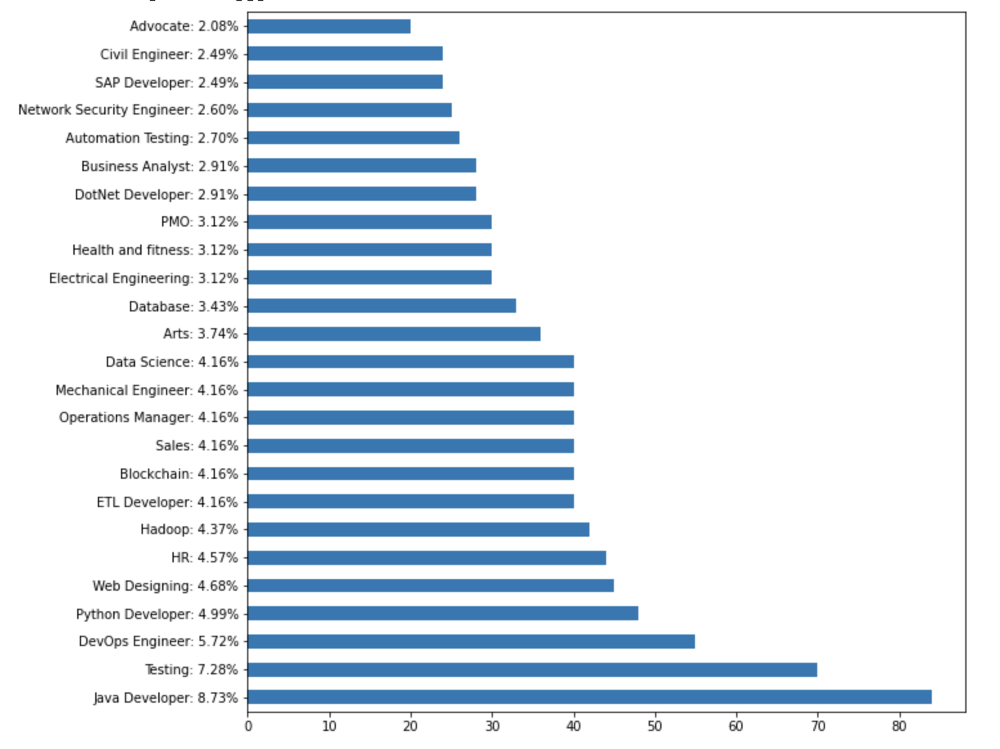

# Classification des CV avec NLP

Lien des données [ici](https://drive.google.com/file/d/1UMZm79V_wm2hE1Rq7mkXfR_DmQipB0aM/view?usp=sharing)

Les entreprises reçoivent souvent des milliers de CVs pour chaque offre d'emploi et emploient des agents de contrôle dédiés pour sélectionner les candidats qualifiés. L'objectif est de développer un modèle IA pour le filtrage des CVs.

## Dependance
- python3
- sklearn
- pandas 
- numpy
- BeautifulSoup
- WordCloud

## Les données


Les données sont des review de CV **[Resume]** et le post **[Category]**




## Traitement de donnée 
1) Il faut pour commencer nettoyer les **[Resume]**
- Suprimer le bruit
- Tout avoir en minuscule
- Suprimer les stopwords
- Transformer en une liste

```python
requiredTarget = df['Category'].values
requiredText = df['Resume'].values


word_vectorizer = TfidfVectorizer(
    sublinear_tf=True,
    stop_words='english',
    max_features=1500)
word_vectorizer.fit(requiredText)
WordFeatures = word_vectorizer.transform(requiredText)

word_vectorizer.fit(requiredText)
WordFeatures = word_vectorizer.transform(requiredText)
````
Sa nous retourne des vectors de chiffre 


2) Maintenant on va pouvoir split les données pour pouvoir crée le model **RandomForestClassifier**


```python
X_train,X_test,y_train,y_test = train_test_split(WordFeatures,requiredTarget,random_state=0, test_size=0.2)

clf = RandomForestClassifier(n_estimators=100, random_state=0)
clf.fit(X_train, y_train)

predictions = clf.predict(X_test)
```


```python
accuracy_score(y_test, predictions)

>>> 0.9948186528497409
```

